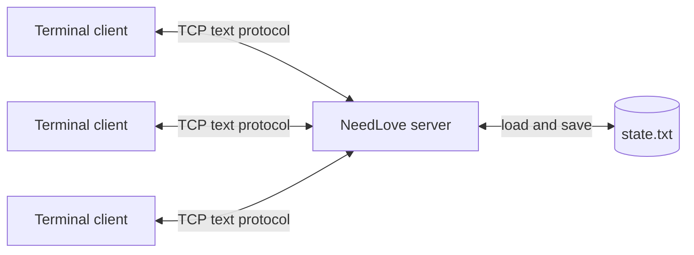

# Dating App

A concurrent terminal dating application built in C with Berkeley sockets and
`select()`. One authoritative server manages profiles, discovery, mutual
matching, live chat, offline messages, and durable state for multiple clients.

[](https://en.wikipedia.org/wiki/C99)
[](LICENSE)

## Highlights

- Event-driven server handles many clients in one `select()` loop.
- Nonblocking sockets and per-client output queues prevent slow clients from
  blocking the server.
- Mutual preferences and likes determine candidate visibility and matches.
- Live chat notifications coexist with interactive terminal input.
- Messages, unread counts, profiles, matches, and swipe history survive restarts.
- Inputs are validated and bounded; `SIGPIPE` and partial reads/writes are handled.

## Architecture



The server owns all application state. Clients render the interface, collect
commands, and process asynchronous events. See [Architecture](docs/ARCHITECTURE.md)
and [Protocol](docs/PROTOCOL.md) for implementation details.

## Quick start

Requirements: a POSIX-like system and a C99 compiler (`cc`, Clang, or GCC).

```bash
git clone https://github.com/DarrenChailand/needlove.git
cd needlove
make
```

Start the server:

```bash
make run-server
```

Then open two or more terminals and run:

```bash
make run-client
```

To connect to a remote host or use another port:

```bash
./bin/needlove-client 192.168.1.25
make clean && make PORT=5000
```

The client walks each user through login and profile setup. Create two users
with compatible preferences, like each other, then open **Chat** to test live
and offline messaging.

## Demo

[Watch the demonstration](https://youtu.be/QPckxzrPdfc)

## Project layout

```text
needlove/
├── src/
│   ├── client.c
│   └── server.c
├── docs/
│   ├── ARCHITECTURE.md
│   └── PROTOCOL.md
├── scripts/
│   └── smoke_test.py
├── Makefile
├── LICENSE
└── README.md
```

## Verification

```bash
make clean && make
python3 scripts/smoke_test.py
make debug
```

The smoke test starts an isolated server, connects two TCP clients, and checks
login, profile creation, candidate discovery, mutual matching, and messaging.

## Technical constraints

This is a systems-programming demonstration, not a production dating service.
It intentionally uses an in-memory fixed-capacity model and a custom text file
instead of a database. Traffic is unencrypted, and username-only login is not
authentication. Do not expose the server to the public internet.

## License

Released under the [MIT License](LICENSE).

